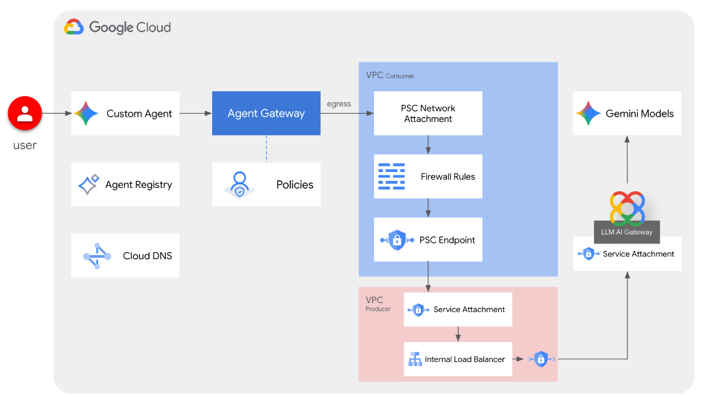

# agent-platform-apigee-llm-internal

> **Secure Private Egress from Vertex AI Agent Runtime to Apigee X LLM AI Gateway**

This repository contains the complete infrastructure scripts, ADK agent implementation, and step-by-step documentation for integrating **Google Cloud Agent Gateway** and **Vertex AI Agent Runtime** with an internal **Apigee X** deployment.

---

## 🌟 Executive Overview & Architectural Value

From a network and enterprise architecture perspective, this solution represents the **ideal private connectivity model**: it enables an AI agent deployed on **Vertex AI Agent Runtime** to route its egress traffic through **Agent Gateway** and access an internal **Apigee X** instance in a **completely private manner** (with zero public internet exposure).



By routing all LLM interactions through an Apigee X **LLM AI Gateway** proxy, enterprise organizations gain access to a comprehensive suite of governance, security, operational resilience, and cost optimization capabilities directly in front of their foundation models:

- **Enforce Token Quotas & API Product Tiers**: Utilize API product tiers and enforce strict token budgets per client application, preventing unexpected cost overruns and enabling internal multi-tenant chargeback.
- **Protect Endpoints with Prompt Rate Limiting**: Mitigate sudden token consumption spikes, prevent denial-of-wallet scenarios, and protect backend LLM quotas using prompt-based rate limiting.
- **Leverage Semantic Vector Caching**: Drastically reduce latency to sub-50ms and lower model operational costs by serving cached responses for semantically equivalent queries using Vector Search.
- **Apply Google Model Armor Threat Defense**: Shield backend foundation models against prompt injection attacks, jailbreaking attempts, and system prompt leakage before requests ever reach the LLM.
- **De-Identify Sensitive Data with Cloud DLP**: Leverage Sensitive Data Protection (Cloud DLP) to automatically detect, mask, or redact sensitive personally identifiable information (PII) such as SSNs, credit card numbers, and email addresses in both incoming user prompts and outgoing model responses.
- **Implement Intelligent Hybrid Model Routing**: Dynamically route traffic between private local models (such as Gemma on Cloud Run CPU) and frontier Gemini models on Vertex AI based on vector similarity intent classification and query complexity.
- **Ensure Automated Model Failover & Resiliency**: Automatically failover execution from primary LLM targets (e.g., Gemini Pro) to fallback endpoints (e.g., Gemini Flash) upon backend 5xx errors or 429 rate limits, maximizing agent availability.
- **Implement a Robust Audit Trail**: Capture comprehensive end-to-end telemetry, metadata, and token counts for regulatory compliance, cost center allocation, and detailed logging.
- **Analyze Governance & Security Analytics**: Monitor and inspect real-time token consumption trends, cache hit ratios, threat mitigation events, and cost distribution across teams using Apigee analytics and dashboards.

---

## 📁 Repository & Script Structure

The project uses a modular script architecture where a main orchestrator calls specialized phase scripts:

- **`env.sh`**: Centralized shared environment variables.
- **`setup_internal_agent_gateway.sh`**: Main setup orchestrator calling specialized setup scripts in sequence.
- **`cleanup_internal_agent_gateway.sh`**: Main cleanup orchestrator calling specialized cleanup scripts in reverse sequence.
- **`01_initial_setup.sh`**: Specialized script for initial environment setup, project variables, and API enablement.
- **`cleanup_01_initial_setup.sh`**: Cleanup script for Phase 1.
- **`02_network_setup.sh`**: Specialized script for VPC network, firewall policies, PSC network attachment, and forwarding rules.
- **`cleanup_02_network_setup.sh`**: Cleanup script for Phase 2.
- **`03_agent_gateway_setup.sh`**: Specialized script for creating and importing Agent Gateway network configuration.
- **`cleanup_03_agent_gateway_setup.sh`**: Cleanup script for Phase 3.
- **`04_agent_registry_setup.sh`**: Specialized script for registering Agent Registry services and interfaces.
- **`cleanup_04_agent_registry_setup.sh`**: Cleanup script for Phase 4.

### 🔄 Idempotency & Re-execution Protection

All setup scripts (`01_initial_setup.sh`, `02_network_setup.sh`, `03_agent_gateway_setup.sh`, `04_agent_registry_setup.sh`) include pre-execution verification checks (`gcloud ... describe &>/dev/null`).

Before executing any resource creation command (VPCs, Subnets, Firewall Policies, Network Attachments, NEGs, Backend Services, Certificates, Target Proxies, Forwarding Rules, Service Attachments, DNS Zones/Records, Agent Gateways, and Agent Registry Services), the script verifies if the resource is already present:

- **If the resource already exists:** Creation is safely skipped with an informative message (`INFO: <resource> already exists`).
- **If the resource is missing:** Creation proceeds normally.

This design enables running any setup script or the main orchestrator (`setup_internal_agent_gateway.sh`) multiple times without throwing errors or requiring a cleanup beforehand.

---

## 🔑 Phase 1: Initial Setup & Environment Configuration

### 1. Set Active Google Cloud Project

```bash
gcloud config set project agent-platform-exp
```

### 2. Authenticate Session

```bash
# Authenticate session
gcloud auth login
gcloud auth application-default login
```

### 3. Set Shell Environment Variables

```bash
# Set shell environment variables
export SLUG="apigee"
export REGION="us-central1"
echo ${SLUG}
echo ${REGION}
```

### 4. Create Project Variables (Automatic)

```bash
# create project vars (automatic)
export PROJ_ID=$(gcloud config list --format="value(core.project)")
export PROJ_NO=$(gcloud projects describe ${PROJ_ID} --format="value(projectNumber)")
export ORG_ID=$(gcloud projects get-ancestors ${PROJ_ID} --format="value(id)" | tail -n 1)
export USER_IDENTITY=$(gcloud config get-value account)
echo ${PROJ_ID}
echo ${PROJ_NO}
echo ${ORG_ID}
echo ${USER_IDENTITY}
```

### 5. Create Resource Variables (Automatic)

```bash
# create resource vars (automatic)
export AGW_NAME="agw-${SLUG}-${REGION}-ata"
export AGW_URI="projects/${PROJ_ID}/locations/${REGION}/agentGateways/${AGW_NAME}"
export RE_AGENT_NAME="simple-agent"
export RE_AGENT_ID_SET="principalSet://agents.global.org-${ORG_ID}.system.id.goog/attribute.platformContainer/aiplatform/projects/${PROJ_NO}"
export STAGING_BUCKET="agent-staging-${PROJ_NO}"
export APIGEE_SVC_ATTACHMENT="projects/your-apigee-tp/regions/${REGION}/serviceAttachments/apigee-${REGION}-xxxx"
echo ${AGW_NAME}
echo ${AGW_URI}
echo ${RE_AGENT_NAME}
echo ${RE_AGENT_ID_SET}
echo ${STAGING_BUCKET}
echo ${APIGEE_SVC_ATTACHMENT}
```

### 6. Create Local Directory for Config Files

```bash
# create local dir for config files
mkdir -p cfg
```

### 7. Update Google Cloud CLI

```bash
# update gcloud cli
gcloud components update
```

### 8. Enable Google APIs

```bash
# enable google apis (agent platform bundle, part 1)
gcloud services enable \
  agentregistry.googleapis.com \
  aiplatform.googleapis.com \
  apphub.googleapis.com \
  apptopology.googleapis.com \
  cloudapiregistry.googleapis.com \
  cloudtrace.googleapis.com \
  compute.googleapis.com \
  dataform.googleapis.com \
  iam.googleapis.com \
  iamconnectors.googleapis.com \
  iap.googleapis.com \
  logging.googleapis.com \
  modelarmor.googleapis.com \
  monitoring.googleapis.com \
  networksecurity.googleapis.com \
  networkservices.googleapis.com \
  notebooks.googleapis.com \
  observability.googleapis.com

# enable google apis (agent platform bundle, part 2)
gcloud services enable \
  securitycenter.googleapis.com \
  saasservicemgmt.googleapis.com \
  storage.googleapis.com \
  telemetry.googleapis.com \
  texttospeech.googleapis.com

# enable google apis (all the rest)
gcloud services enable \
  run.googleapis.com \
  artifactregistry.googleapis.com \
  cloudbuild.googleapis.com \
  dns.googleapis.com
```

---

## 🌐 Phase 2: Network Infrastructure & ILB + PSC Setup (`02_network_setup.sh`)

### 📐 Architecture Overview: Multi-VPC Private Service Connect Design

#### 1. Why Do We Need a PSC Network Attachment (`psc-na-us-central1-agw`)?

In Google Cloud, managed services such as **Vertex AI Agent Runtime (Reasoning Engine)** and **Agent Gateway** execute inside Google-managed tenant projects. By default, workloads inside these tenant projects have no direct network presence or routing visibility into a customer's private Virtual Private Cloud (VPC).

A **PSC Network Attachment** solves this challenge by serving as an inbound landing interface:
- **Direct Egress Ingress**: It provides a dedicated point of attachment in the consumer subnet (`subnet-us-central1-agw`) through which Google-managed workloads can establish outbound network connections directly into the customer VPC.
- **Zero VPC Peering Overhead**: Unlike traditional VPC Network Peering, it avoids RFC 1918 CIDR overlapping constraints, transitive routing limitations, and complex peering quota management.
- **Strict Customer Governance**: All egress traffic entering the VPC via the Network Attachment is strictly subject to the customer's Cloud Firewall Policies, Cloud NAT, and Private DNS resolution rules.
- **Private DNS Resolution**: Through `dnsPeeringConfigs` configured on the Reasoning Engine's `pscInterfaceConfig`, the managed agent pod queries the customer's Private DNS Zone (`priv-zone-run`) to resolve private endpoints such as `apigee.iloveagents.io`.

#### 2. The Core PSC Constraint: Service Attachment & PSC Endpoint CANNOT Be in the Same VPC

A fundamental design rule of Google Cloud Private Service Connect governs the relationship between Service Attachments and PSC Endpoints:

> ⚠️ **GCP PSC Architectural Rule:** A **PSC Service Attachment** (producer) and a **PSC Forwarding Rule / Endpoint** (consumer) targeting it **CANNOT reside in the same VPC network**.

**Why is this rule enforced by Google Cloud?**
1. **Cross-VPC Boundary Design**: Private Service Connect is purpose-built to traverse trust and isolation boundaries between distinct VPC networks (e.g., between an enterprise consumer and a SaaS/platform producer).
2. **Routing Ambiguity & Packet Looping**: A PSC connection relies on SDN-level encapsulation (GENEVE/VPC tunnel) that maps consumer IP packets to producer NAT IPs (`subnet-psc-nat`). If both the consumer endpoint and the target service attachment lived in the same VPC routing table, the routing engine would encounter ambiguous routes for the same destination IP and subnet, leading to packet looping, asymmetric return traffic, and dropped connections.
3. **Producer-Consumer Isolation**: By strictly enforcing that the Service Attachment and Endpoint reside in separate networks, GCP guarantees clear tenant isolation, independent firewall domains, and distinct security postures.

#### 3. The Two-VPC Architecture Solution

To strictly adhere to this constraint while providing an end-to-end private path between Agent Runtime, Agent Gateway, and Apigee X, the infrastructure is segregated into two specialized VPC networks:

1. **Consumer VPC (`vnet-${SLUG}`)**:
   - **Subnet:** `subnet-${REGION}-agw` (`192.168.10.0/28`)
   - **PSC Network Attachment:** `psc-na-${REGION}-agw` providing the landing interface for Agent Runtime / Agent Gateway egress.
   - **PSC Consumer Endpoint:** `psc2apigeex` (Forwarding Rule with allocated private IP `192.168.10.4`) pointing to the Service Attachment in the Producer VPC.
   - **Cloud DNS Private Zone:** `priv-zone-run` mapping domain `apigee.iloveagents.io` to the PSC Endpoint IP (`192.168.10.4`).

2. **Producer VPC (`vnet-${SLUG}-producer`)**:
   - **Primary Subnet:** `subnet-${REGION}-producer-ilb` (`10.20.0.0/24`) hosting the Internal Application Load Balancer (`forwarding-rule-apigee-ilb` @ `10.20.0.5`).
   - **Regional Proxy-Only Subnet:** `subnet-${REGION}-proxy` (`10.9.0.0/24`, `purpose=REGIONAL_MANAGED_PROXY`) required by Envoy-based Internal ALBs.
   - **PSC NAT Subnet:** `subnet-${REGION}-psc-nat` (`10.10.0.0/24`, `purpose=PRIVATE_SERVICE_CONNECT`) providing source NAT translation for consumer connections traversing the Service Attachment.
   - **PSC Service Attachment:** `sa-apigee-ilb` exposing the Internal Load Balancer to the Consumer VPC.
   - **PSC Network Endpoint Group (NEG):** `neg-apigee-psc` forwarding traffic from the ILB backend service directly into Apigee X's tenant service attachment.

```mermaid
flowchart LR
    subgraph GoogleTenant["Google Managed Tenant Projects"]
        Runtime["Vertex AI Agent Runtime<br/>(Pod SPIFFE Identity)"]
        AGW["Agent Gateway Instance<br/>(agw-apigee-us-central1-ata)"]
    end

    subgraph ConsumerVPC["Consumer VPC (vnet-apigee)"]
        NA["PSC Network Attachment<br/>(psc-na-us-central1-agw)"]
        DNS["Private Cloud DNS<br/>apigee.iloveagents.io -> 192.168.10.4"]
        EP["PSC Consumer Endpoint<br/>(psc2apigeex @ 192.168.10.4)"]
    end

    subgraph ProducerVPC["Producer VPC (vnet-apigee-producer)"]
        SA["PSC Service Attachment<br/>(sa-apigee-ilb + NAT Subnet)"]
        ILB["Internal Application LB<br/>(forwarding-rule-apigee-ilb @ 10.20.0.5)"]
        NEG["PSC NEG Backend<br/>(neg-apigee-psc)"]
    end

    subgraph ApigeeTenant["Apigee X Tenant Project"]
        ApigeeSA["Apigee Service Attachment"]
        ApigeeProxy["Apigee LLM Proxy<br/>(llm-ai-gateway-v1)"]
        Gemini["Vertex AI Gemini Model"]
    end

    Runtime -->|pscInterfaceConfig| AGW
    AGW -->|Egress| NA
    NA --> DNS
    DNS --> EP
    EP -->|PSC Cross-VPC Boundary| SA
    SA --> ILB
    ILB --> NEG
    NEG -->|PSC Boundary| ApigeeSA
    ApigeeSA --> ApigeeProxy
    ApigeeProxy --> Gemini
```



#### 4. Critical TLS Handshake Requirement: Public CA Certificate & Public Domain Ownership

For the complete end-to-end communication chain to operate securely, all egress requests originating from the **Vertex AI Agent Runtime** container targeting the internal Apigee X hostname (`https://apigee.iloveagents.io/...`) must traverse the PSC interface, reach the ILB, and complete a valid TLS handshake.

> [!IMPORTANT]
> **TLS Handshake & Trusted Certificate Authority (CA) Requirement**
> For the TLS handshake between the Vertex AI Agent Runtime container and the Internal Load Balancer (ILB) to succeed, the certificate presented by the ILB **must be issued by a trusted Certificate Authority (CA)**.
>
> - **System CA Trust Store Enforcement**: Workloads running on Vertex AI Agent Runtime operate in managed container runtimes where standard client runtimes (e.g., Python `urllib3`, `requests`, `httpx`, gRPC) strictly validate server certificates against official public root CAs (such as the Mozilla CA bundle).
> - **Failure of Self-Signed Certificates**: If the ILB presents a self-signed certificate, the agent container's TLS client will immediately terminate the handshake with a certificate verification failure (`ssl.SSLCertVerificationError: [SSL: CERTIFICATE_VERIFY_FAILED] certificate verify failed: self-signed certificate in certificate chain`).
> - **Public Domain Ownership Requirement**: To issue a trusted certificate via Google Certificate Manager, Google requires domain control validation via DNS authorization (ACME CNAME challenge). **This requires you to own a public DNS domain to provision a Google-managed certificate**. You must have administrative access to configure a DNS authorization CNAME record in your public DNS zone (such as `iloveagents.io`) to validate domain ownership.

### 1. Create VPC Networks and Subnets

```bash
# create consumer and producer vpc networks
gcloud compute networks create vnet-${SLUG} --subnet-mode=custom
gcloud compute networks create vnet-${SLUG}-producer --subnet-mode=custom

# primary subnet for agent gateway & psc endpoint in consumer vpc
gcloud compute networks subnets create subnet-${REGION}-agw \
  --network=vnet-${SLUG} \
  --range=192.168.10.0/28 \
  --region=${REGION} \
  --enable-private-ip-google-access

# primary subnet for ilb in producer vpc
gcloud compute networks subnets create subnet-${REGION}-producer-ilb \
  --network=vnet-${SLUG}-producer \
  --range=10.20.0.0/24 \
  --region=${REGION} \
  --enable-private-ip-google-access

# regional managed proxy-only subnet for internal application load balancer in producer vpc
gcloud compute networks subnets create subnet-${REGION}-proxy \
  --network=vnet-${SLUG}-producer \
  --range=10.9.0.0/24 \
  --region=${REGION} \
  --purpose=REGIONAL_MANAGED_PROXY \
  --role=ACTIVE

# psc nat subnet for service attachment in producer vpc
gcloud compute networks subnets create subnet-${REGION}-psc-nat \
  --network=vnet-${SLUG}-producer \
  --range=10.10.0.0/24 \
  --region=${REGION} \
  --purpose=PRIVATE_SERVICE_CONNECT
```

### 2. Configure Firewall Policies and Rules

```bash
# create firewall policy
gcloud compute network-firewall-policies create fw-policy-${SLUG} --global

# create fw policy rule
gcloud compute network-firewall-policies rules create 1001 \
  --description="allow all out and log" \
  --firewall-policy=fw-policy-${SLUG} \
  --global-firewall-policy \
  --action=allow \
  --direction=EGRESS \
  --layer4-configs=all \
  --dest-ip-ranges=0.0.0.0/0 \
  --enable-logging

# associate fw policy to consumer and producer vpc networks
gcloud compute network-firewall-policies associations create \
  --name=fw-policy-bind-${SLUG}-consumer \
  --firewall-policy=fw-policy-${SLUG} \
  --network=vnet-${SLUG} \
  --global-firewall-policy

gcloud compute network-firewall-policies associations create \
  --name=fw-policy-bind-${SLUG}-producer \
  --firewall-policy=fw-policy-${SLUG} \
  --network=vnet-${SLUG}-producer \
  --global-firewall-policy
```

### 3. Create Private Service Connect (PSC) Network Attachment

```bash
# create psc network attachment in consumer vpc (for agent gateway egress)
gcloud compute network-attachments create psc-na-${REGION}-agw \
  --region=${REGION} \
  --subnets=subnet-${REGION}-agw \
  --connection-preference=ACCEPT_AUTOMATIC

# fetch psc na uri
export PSC_NA_URI=$(gcloud compute network-attachments describe psc-na-${REGION}-agw \
  --region=${REGION} \
  --format="value(selfLink.scope(v1))")
echo ${PSC_NA_URI}
```

### 4. Create Regional Internal Application Load Balancer (ILB) Components in Producer VPC

> [!IMPORTANT]
> **TLS Handshake & Public Certificate Authority (CA) Requirement**
> For the TLS handshake between the Vertex AI Agent Runtime container and the Internal Load Balancer (ILB) to succeed, the certificate presented by the ILB **must be issued by a trusted Certificate Authority (CA)**. A self-signed certificate will be rejected by the agent container with `ssl.SSLCertVerificationError`.
> 
> **This requires you to own a public DNS domain to provision a Google-managed certificate.**
> The commands below configure Google Certificate Manager DNS authorization (`auth-apigee-iloveagents`) to verify domain control via an ACME CNAME record in your public Cloud DNS zone (`pub-zone-iloveagents`) before provisioning the Google-managed certificate.

```bash
# create psc neg targeting apigee x service attachment in producer vpc
gcloud compute network-endpoint-groups create neg-apigee-psc \
  --network-endpoint-type=private-service-connect \
  --psc-target-service=${APIGEE_SVC_ATTACHMENT} \
  --network=vnet-${SLUG}-producer \
  --subnet=subnet-${REGION}-producer-ilb \
  --region=${REGION}

# create regional backend service
gcloud compute backend-services create backend-apigee-ilb \
  --load-balancing-scheme=INTERNAL_MANAGED \
  --protocol=HTTPS \
  --region=${REGION}

gcloud compute backend-services add-backend backend-apigee-ilb \
  --network-endpoint-group=neg-apigee-psc \
  --network-endpoint-group-region=${REGION} \
  --region=${REGION}

# create certificate manager dns authorization for domain ownership verification
# NOTE: This requires you to own a public DNS domain to provision a Google-managed certificate
gcloud certificate-manager dns-authorizations create auth-apigee-iloveagents \
  --domain="apigee.iloveagents.io" \
  --location=${REGION}

# describe dns authorization to get CNAME record details
export CNAME_NAME=$(gcloud certificate-manager dns-authorizations describe auth-apigee-iloveagents \
  --location=${REGION} \
  --format="value(dnsResourceRecord.name)")
export CNAME_DATA=$(gcloud certificate-manager dns-authorizations describe auth-apigee-iloveagents \
  --location=${REGION} \
  --format="value(dnsResourceRecord.data)")

# create public Cloud DNS zone if it does not exist
gcloud dns managed-zones create pub-zone-iloveagents \
  --dns-name="iloveagents.io." \
  --description="Public DNS zone for iloveagents.io" \
  --visibility=public 2>/dev/null || echo "INFO: Public DNS zone pub-zone-iloveagents already exists or skipped."

# create CNAME record in Public Cloud DNS zone
if gcloud dns managed-zones describe pub-zone-iloveagents &>/dev/null; then
  gcloud dns record-sets create "${CNAME_NAME}" \
    --zone=pub-zone-iloveagents \
    --type=CNAME \
    --ttl=300 \
    --rrdatas="${CNAME_DATA}" 2>/dev/null || echo "INFO: CNAME record set may already exist in public Cloud DNS."
else
  echo "WARNING: Public Cloud DNS zone 'pub-zone-iloveagents' not found. Please manually add CNAME record ${CNAME_NAME} -> ${CNAME_DATA}"
fi

# create certificate manager managed certificate using dns authorization
gcloud certificate-manager certificates create cert-apigee-ilb \
  --domains="apigee.iloveagents.io" \
  --dns-authorizations=auth-apigee-iloveagents \
  --location=${REGION}

# create regional url map & target https proxy using certificate manager certificate
gcloud compute url-maps create urlmap-apigee-ilb \
  --default-service=backend-apigee-ilb \
  --region=${REGION}

gcloud compute target-https-proxies create target-proxy-apigee-ilb \
  --url-map=urlmap-apigee-ilb \
  --certificate-manager-certificates=cert-apigee-ilb \
  --region=${REGION}

export ILB_IP="10.20.0.5"
echo ${ILB_IP}

# reserve internal ip for ilb forwarding rule in producer vpc
gcloud compute addresses create ip-ilb-apigee \
  --region=${REGION} \
  --subnet=subnet-${REGION}-producer-ilb \
  --addresses=${ILB_IP}

# create internal forwarding rule for ilb in producer vpc
gcloud compute forwarding-rules create forwarding-rule-apigee-ilb \
  --load-balancing-scheme=INTERNAL_MANAGED \
  --network=vnet-${SLUG}-producer \
  --subnet=subnet-${REGION}-producer-ilb \
  --address=ip-ilb-apigee \
  --ports=443 \
  --target-https-proxy=target-proxy-apigee-ilb \
  --target-https-proxy-region=${REGION} \
  --region=${REGION}
```

### 5. Create PSC Service Attachment for the ILB in Producer VPC

```bash
# create service attachment for ilb
gcloud compute service-attachments create sa-apigee-ilb \
  --region=${REGION} \
  --producer-forwarding-rule=forwarding-rule-apigee-ilb \
  --connection-preference=ACCEPT_AUTOMATIC \
  --nat-subnets=subnet-${REGION}-psc-nat

export ILB_SA_URI=$(gcloud compute service-attachments describe sa-apigee-ilb \
  --region=${REGION} \
  --format="value(selfLink.scope(v1))")
echo ${ILB_SA_URI}
```

### 6. Create PSC Endpoint connecting Consumer VPC to the ILB Service Attachment

```bash
export PSC_EP_IP="192.168.10.4"
echo ${PSC_EP_IP}

# reserve internal regional ipv4 address in consumer subnet
gcloud compute addresses create ip-psc2apigeex \
  --region=${REGION} \
  --subnet=subnet-${REGION}-agw \
  --addresses=${PSC_EP_IP}

# create psc endpoint pointing to ilb service attachment
gcloud compute forwarding-rules create psc2apigeex \
  --region=${REGION} \
  --network=vnet-${SLUG} \
  --address=ip-psc2apigeex \
  --target-service-attachment=${ILB_SA_URI}

# show psc endpoint details
gcloud compute forwarding-rules describe psc2apigeex --region=${REGION}
```

### 7. Configure Private DNS Zone, Record & Logging Policy in Consumer VPC

```bash
# create private dns zone
gcloud dns managed-zones create priv-zone-run \
  --description="private zone apigee instance" \
  --dns-name="iloveagents.io." \
  --visibility=private \
  --networks=vnet-${SLUG}

# create dns record
gcloud dns record-sets create apigee.iloveagents.io \
  --zone=priv-zone-run \
  --type=A \
  --ttl=300 \
  --rrdatas=${PSC_EP_IP}

# create dns policy (logging)
gcloud dns policies create dns-policy-${SLUG} \
  --description="dns logging for vnet-${SLUG}" \
  --networks=vnet-${SLUG} \
  --enable-logging
```

---

## 🤖 Phase 3: Agent Gateway Setup (`03_agent_gateway_setup.sh`)

### 1. Create Agent Gateway Configuration File (`cfg/${AGW_NAME}-networkConfig.yaml`)

```bash
# create new agent gateway config file (with network settings)
cat > cfg/${AGW_NAME}-networkConfig.yaml << EOF
name: ${AGW_NAME}
protocols:
  - MCP
googleManaged:
  governedAccessPath: AGENT_TO_ANYWHERE
registries:
  - "//agentregistry.googleapis.com/projects/${PROJ_ID}/locations/${REGION}"
networkConfig:
  egress:
    networkAttachment: ${PSC_NA_URI}
  dnsPeeringConfig:
    domains:
      - iloveagents.io.
    targetProject: ${PROJ_ID}
    targetNetwork: projects/${PROJ_ID}/global/networks/vnet-${SLUG}
EOF
```

### 2. Import Agent Gateway & Inspect Configuration

```bash
# import agent gateway config file (create gateway)
gcloud network-services agent-gateways import ${AGW_NAME} \
  --source="cfg/${AGW_NAME}-networkConfig.yaml" \
  --location=${REGION}

# show agent gateway details
gcloud network-services agent-gateways describe ${AGW_NAME} \
  --location=${REGION}

# show psc network attachment details
gcloud compute network-attachments describe psc-na-${REGION}-agw --region=${REGION}
```

---

## 🗂️ Phase 4: Agent Registry Setup (`04_agent_registry_setup.sh`)

### 1. Create Core Endpoint Service & Interfaces

```bash
# create endpoint service (with multiple entries)
gcloud agent-registry services create core-gapi-services \
  --location=${REGION} \
  --display-name="gapi.core.services" \
  --description="core apis and services" \
  --endpoint-spec-type=no-spec \
  --interfaces=protocolBinding=JSONRPC,url=https://telemetry.googleapis.com \
  --interfaces=protocolBinding=JSONRPC,url=https://${REGION}-aiplatform.googleapis.com \
  --interfaces=protocolBinding=JSONRPC,url=https://cloudresourcemanager.googleapis.com \
  --interfaces=protocolBinding=JSONRPC,url=https://iamcredentials.googleapis.com
```

### 2. Create Apigee X Endpoint Service

```bash
# create apigeex endpoint service in agent registry
gcloud agent-registry services create apigeex \
  --location=${REGION} \
  --display-name="apigeex" \
  --description="Apigee X internal endpoint" \
  --endpoint-spec-type=no-spec \
  --interfaces=protocolBinding=JSONRPC,url=https://apigee.iloveagents.io
```

### 3. List Regional Registry Endpoints

```bash
# list registry regional endpoints
gcloud agent-registry endpoints list --location=${REGION} \
  --flatten="interfaces[]" \
  --format="table(displayName, name.basename():label=ENDPOINT_ID, interfaces.url:label=URL)"
```

---

## 🤖 Phase 5: Deploy ADK Agent with ApigeeLLM to Agent Runtime (`05_deploy_agent_runtime.sh`)

### 1. Agent Architecture (`agent_apigee/agent.py`)

The agent is built using the **Google Agent Development Kit (ADK)** and uses `ApigeeLlm` as its LLM backend provider:

- **Model Specification**: The model is configured as:
  ```python
  model_name = "apigee/vertex_ai/gemini-2.5-flash"
  ```
  > **Note on Model Routing**: Specifying `vertex_ai` is essential. In `ApigeeLlm`, omitting the provider defaults to the Google AI Studio Developer API (`.../v1beta/models/...`), which is rejected by Apigee's proxy routing condition. With `apigee/vertex_ai/...`, the SDK sets `client.vertexai = True` and constructs the expected Vertex AI path:
  > `https://apigee.iloveagents.io/v1/llm-ai-gateway/v1/projects/${PROJ_ID}/locations/${REGION}/publishers/google/models/gemini-2.5-flash:generateContent`

- **Authentication Header**: Apigee X validates client identity using the `x-apikey` header passed in `custom_headers`:
  ```python
  custom_headers = {
      "x-apikey": self.apikey
  }
  ```

- **Async Execution with ADK Runner**: Vertex AI Agent Runtime serves queries inside an active asynchronous ASGI/FastAPI event loop. The agent declares `async def query(self, prompt: str) -> str:` and executes the ADK Agent asynchronously using `google.adk.Runner` and `InMemorySessionService`:
  ```python
  async def query(self, prompt: str) -> str:
      session = await self._session_service.create_session(
          app_name="simple_apigee_agent",
          user_id="end_user"
      )
      response_text = ""
      async for event in self._runner.run_async(
          user_id="end_user",
          session_id=session.id,
          new_message=types.Content(
              role="user",
              parts=[types.Part.from_text(text=prompt)]
          )
      ):
          if hasattr(event, "content") and event.content:
              for part in event.content.parts:
                  if hasattr(part, "text") and part.text:
                      response_text += part.text
      return response_text
  ```

### 2. Packaging & Deploying to Agent Runtime (`agent_apigee/deploy_agent.py`)

The deployment script packages the agent and deploys it as a **Vertex AI Reasoning Engine** resource:

1. **Cloudpickle Serialization**: Calls `cloudpickle.register_pickle_by_value(agent)` to serialize the module directly into `reasoning_engine.pkl`.
2. **Workload Identity**: Configured with `identity_type="AGENT_IDENTITY"` (SPIFFE Workload Identity).
3. **Baked-in PSC Interface & Private DNS**: The `pscInterfaceConfig` is supplied directly in `ReasoningEngineSpec.DeploymentSpec` at creation time:
   ```python
   psc_config = aiplatform.PscInterfaceConfig(
       network_attachment=f"projects/{args.project}/regions/{args.region}/networkAttachments/psc-na-{args.region}-agw",
       dns_peering_configs=[
           aiplatform.DnsPeeringConfig(
               domain="iloveagents.io.",
               target_project=args.project,
               target_network="vnet-apigee"
           )
       ]
   )
   ```
4. **Environment Variables**: Sets `GOOGLE_CLOUD_LOCATION` while letting Vertex AI manage the reserved `GOOGLE_CLOUD_PROJECT` variable.

```bash
# deploy agent runtime workload
./05_deploy_agent_runtime.sh
```

---

## 💬 Phase 6: Query Deployed Agent (`06_query_agent.sh`)

You can test the full end-to-end integration using any of the following methods:

### 1. Using the Helper Script (`06_query_agent.sh`)

```bash
./06_query_agent.sh "pourquoi le ciel est bleu?"
```

### 2. Using Python Vertex AI SDK

```python
import vertexai
from vertexai.preview import reasoning_engines

vertexai.init(project="${PROJ_ID}", location="${REGION}")
engine = reasoning_engines.ReasoningEngine("projects/${PROJ_ID}/locations/${REGION}/reasoningEngines/${RE_ENGINE_ID}")
response = engine.query(prompt="pourquoi le ciel est bleu?")
print("RESPONSE:", response)
```

### 3. Using `curl` REST API

```bash
export TOKEN=$(gcloud auth application-default print-access-token)

curl -X POST \
  -H "Authorization: Bearer ${TOKEN}" \
  -H "Content-Type: application/json; charset=utf-8" \
  -d '{
    "class_method": "query",
    "input": {
      "prompt": "pourquoi le ciel est bleu?"
    }
  }' \
  "https://${REGION}-aiplatform.googleapis.com/v1/projects/${PROJ_ID}/locations/${REGION}/reasoningEngines/${RE_ENGINE_ID}:query"
```

---

### 🔍 4. Technical Comparison: Python Vertex AI SDK vs. Direct REST API Call

While both methods invoke the same underlying Reasoning Engine endpoint on Vertex AI Agent Runtime, they operate differently across several architectural layers:

#### 1. Transport Protocol & Performance (gRPC vs. HTTP)
- **Python Vertex AI SDK**:
  Under the hood, the Vertex AI SDK uses **gRPC over HTTP/2**. It communicates with Google Cloud backend services via binary Protocol Buffers (`protobuf`). This provides multiplexed streams over persistent TCP connections, significantly lower network overhead, and optimized binary serialization for high-throughput and low-latency invocations.
- **REST API (`curl`)**:
  Operates over standard **HTTPS (HTTP/1.1 or HTTP/2)** using textual JSON payloads. Each standalone `curl` command executes a new TLS handshake and TCP connection setup unless an HTTP keep-alive session is explicitly reused by an application client.

#### 2. Method Dispatch & Payload Modeling
- **Python Vertex AI SDK**:
  Provides an idiomatic, object-oriented Python interface (`engine.query(...)`). Method discovery, parameter serialization, type checking, and response unmarshalling are handled transparently by the SDK. The response is returned directly as native Python objects (e.g., `str`, `dict`, or custom types).
- **REST API (`curl`)**:
  Requires callers to explicitly implement the Vertex AI Reasoning Engine JSON-RPC dispatch schema in the request body:
  ```json
  {
    "class_method": "query",
    "input": {
      "prompt": "pourquoi le ciel est bleu?"
    }
  }
  ```
  The caller is responsible for constructing this JSON structure and parsing the raw response envelope:
  ```json
  {
    "output": "Le ciel apparaît bleu principalement en raison..."
  }
  ```

#### 3. Authentication & Credential Lifecycle
- **Python Vertex AI SDK**:
  Integrates natively with the Google Auth library (`google.auth.default()`). It automatically discovers Application Default Credentials (ADC), computes the required OAuth2 scopes, caches access tokens in memory, and automatically refreshes expiring tokens in the background without user intervention.
- **REST API (`curl`)**:
  Requires an explicit Bearer token in the `Authorization` header (`Authorization: Bearer $(gcloud auth print-access-token)`). The caller is solely responsible for acquiring, passing, and refreshing access tokens when they expire (typically after 60 minutes).

#### 4. Resiliency, Retries, and Error Handling
- **Python Vertex AI SDK**:
  Incorporates enterprise-grade retry policies (`google.api_core.retry`) with exponential backoff and jitter for transient errors (e.g., HTTP 503, rate limits 429, or temporary network drops). Unhandled errors are raised as typed Python exceptions (`google.api_core.exceptions.*`).
- **REST API (`curl`)**:
  Does not include built-in retry logic. Any HTTP errors (e.g., 400 Bad Request, 404 Not Found, 503 Service Unavailable) must be caught, parsed, and retried manually by the client application.

#### 5. Language Independence & Ecosystem Integration
- **Python Vertex AI SDK**:
  Restricted to Python environments and requires installing dependencies (`google-cloud-aiplatform`, `google-adk`). Best suited for Python data science pipelines, backend services, and notebooks.
- **REST API (`curl`)**:
  Completely **language-agnostic**. It can be integrated into any technology stack (Go, Java, Node.js, C#, Rust, shell scripts, CI/CD pipelines, Kubernetes sidecars, Postman, or API Gateways) without requiring Google SDK installations.

---

### 📊 Summary Comparison Matrix

| Feature | Python Vertex AI SDK (`reasoning_engines`) | Direct REST API (`curl` / HTTP) |
| :--- | :--- | :--- |
| **Underlying Protocol** | **gRPC over HTTP/2** (binary Protocol Buffers) | **HTTPS / JSON** (HTTP/1.1 or HTTP/2) |
| **Connection Handling** | Persistent connection pooling & multiplexing | Single-shot HTTP request (unless pooled) |
| **Invocation Interface** | Native Python method: `engine.query(prompt=...)` | JSON-RPC payload: `{"class_method": "...", "input": {...}}` |
| **Authentication** | Automatic ADC discovery, caching & auto-refresh | Manual `Authorization: Bearer <TOKEN>` injection |
| **Response Format** | Native Python deserialized types (`str`, `dict`) | Raw JSON string envelope: `{"output": ...}` |
| **Retry & Backoff** | Built-in exponential backoff (`google.api_core.retry`) | Manual client-side retry handling required |
| **Streaming Support** | Native async generators / iterators (`engine.stream_query()`) | Server-Sent Events (SSE) via `:streamQuery` endpoint |
| **Dependencies** | Requires `google-cloud-aiplatform` Python package | Zero client dependencies (standard HTTP client) |
| **Best Used For** | Python applications, AI agent services, pipelines | Polyglot microservices, frontends, shell scripts, CI/CD |


